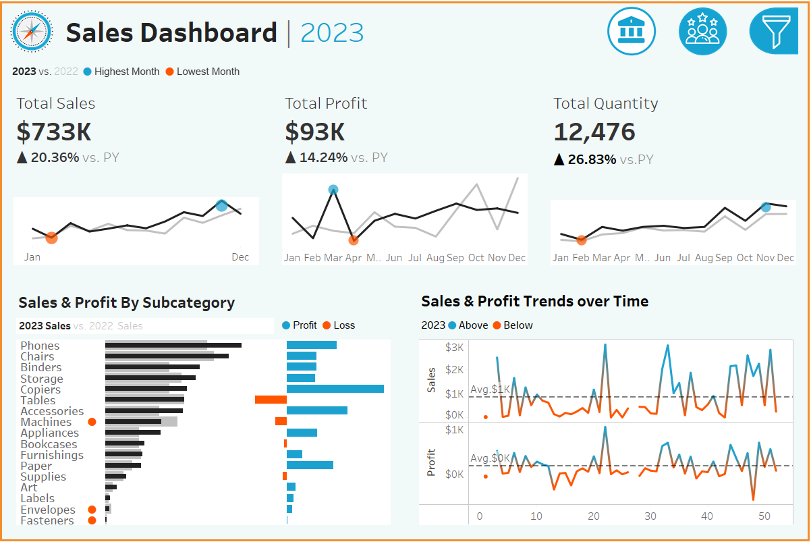
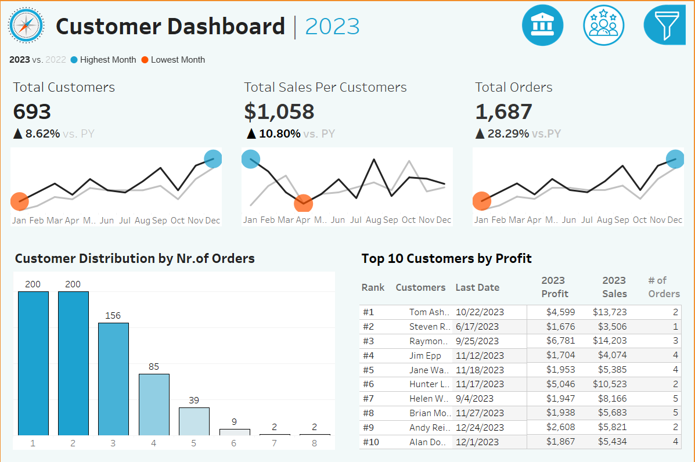

# Sales Data Analysis and Visualization with Tableau

## Overview

This project involves analyzing sales data from multiple sources and presenting insights through interactive dashboards in Tableau. The data spans several key areas of sales, including orders, customers, locations, and products. The focus of the analysis is to highlight trends in sales, profit, and customer behavior, with the goal of deriving actionable insights for business decision-making.

## Data Sources

The analysis was conducted on the following datasets:
- **Orders**: Contains information on individual sales transactions, including order date, quantity, sales amount, and profit.
- **Customers**: Details customer information such as customer ID, name, and purchase history.
- **Location**: Geographic data related to the sales, such as country, state, and city.
- **Products**: Contains product information, including category, subcategory, and product names.

## Dashboards

### 1. Sales Dashboard
This dashboard provides an overview of key sales metrics and trends. The main visualizations include:
- **Sparklines for Total Sales, Total Profit, and Total Quantity**: Show short-term trends in sales performance.
- **Bar Chart: Sales and Profit by Subcategory**: Highlights which product subcategories contribute the most to sales and profitability.
- **Line Chart: Sales and Profit Trend Over Time**: Displays the overall growth and fluctuation in sales and profit over a specific time period.

### 2. Customer Dashboard
This dashboard focuses on customer metrics and behavior patterns. It includes:
- **Sparklines for Total Customers, Total Sales per Customer, and Total Orders**: Show overall trends in customer behavior.
- **Bar Chart: Customer Distribution by Number of Orders**: Provides insights into customer segmentation based on their order frequency.
- **Table: Top 10 Customers by Profit**: Highlights the most valuable customers in terms of profit generation.

 

## Key Insights
- **Sales Trends**: Sales and profit have grown consistently over time, with some fluctuation during specific periods.
- **Product Performance**: Certain subcategories have a significant impact on overall sales, revealing opportunities for focused marketing efforts.
- **Customer Behavior**: A small percentage of customers contribute disproportionately to total profit, indicating potential for loyalty programs or personalized marketing.

## Skills Demonstrated
- **Data Preparation**: Cleaned and preprocessed multiple datasets for analysis.
- **Data Visualization**: Designed and built interactive dashboards in Tableau to effectively communicate insights.
- **Business Analysis**: Identified key trends and patterns to provide actionable insights for improving sales and customer retention.
- **Dashboard Design**: Focused on clarity, interactivity, and storytelling to engage stakeholders.

## How to View
To view the dashboards, you can access the Tableau workbooks or the Tableau Public link [insert Tableau Public link if applicable].
